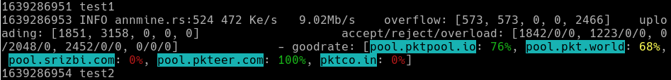

# pktannfilter

This program filters the output (stdout and stderr) of the packetcrypt_rs miner program. It removes all WARN lines which contains the strings `Error uploading ann batch` and `Failed to make request to`.

It also adds the pool names to the `goodrate` output and uses colors for it.

# how to compile and run the program

First install Rust, e.g. from https://rustup.rs. Then you can build the program with `cargo build --release`.

For starting the filter, specify the original mining program as the first program argument, and then the other parameters for the mining program itself as usual. For example:

```
./target/release/pktannfilter ../packetcrypt_rs/target/release/packetcrypt ann 'http://pool.pktpool.io' 'http://pool.pkt.world'  --paymentaddr pkt1xxx`
```

(instead of `pkt1xxx`, use your wallet address)

The shell script `miner-simulation` outputs some simulated miner lines on stderr to demonstrate how the filter works. If you run the script `miner-simulation`, you'll see the unmodified output. If you start it with the pktannfilter (you can use the `test` script for it), you can see how the output is modified.

Example output of the test script:



On Mac, the default Terminal program has no bright yellow color, but because of the default white background, the darker yellow color is better anyway. It looks like this:


With a modern terminal like [Alacritty](https://github.com/alacritty/alacritty), it looks the same as on Linux. On Windows, it looks like on Linux with the standard cmd.exe Command Prompt, and in PowerShell.
